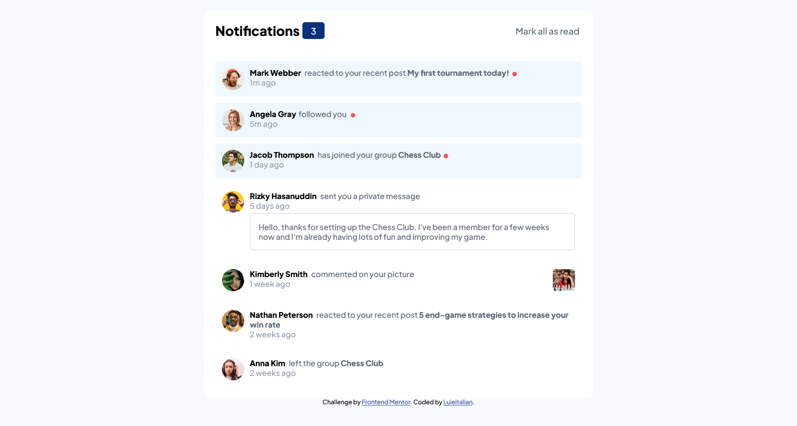

# Frontend Mentor - Notifications page solution

This is a solution to the [Notifications page challenge on Frontend Mentor](https://www.frontendmentor.io/challenges/notifications-page-DqK5QAmKbC). Frontend Mentor challenges help you improve your coding skills by building realistic projects. 

### The challenge

Users should be able to:

- Distinguish between "unread" and "read" notifications
- Select "Mark all as read" to toggle the visual state of the unread notifications and set the number of unread messages to zero
- View the optimal layout for the interface depending on their device's screen size
- See hover states for all interactive elements on the page

### Screenshot

### Links

-  [Solution URL](https://your-solution-url.com)
-  [Live Site URL](https://your-live-site-url.com)

### Built with

- Semantic HTML5 markup
- Flexbox
- Mobile-first workflow

### What I learned

I have learned how to align inline-flex items in a container.

## Author

- Frontend Mentor - [@Luieitalian](https://www.frontendmentor.io/profile/Luieitalian)
- Twitter - [@luieitalian](http://www.twitter.com/luieitalian)
